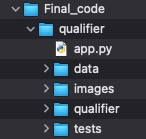
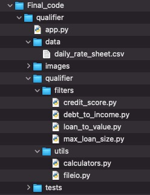
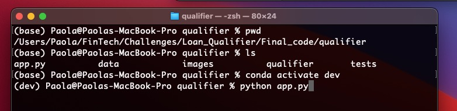
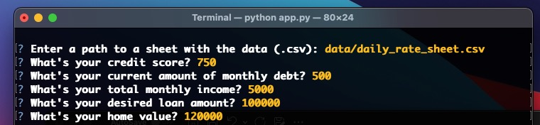
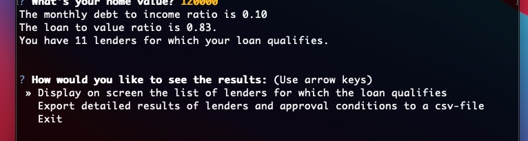
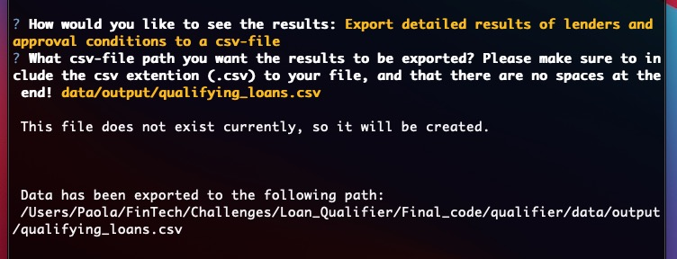

# Loan Qualifier Application

When you need a loan, would'nt be nice just to ask lenders that would approve your request? What about knowing in addition their interest rate, so you can apply to the cheapest at first shot, just from a search on the web?

The Loan Qualifier App enable users for that. Based on their financial circumstances, and the key conditions that lenders use to make approval decisions, the Loan Qualifier App provides as output a list of banks that would approve a requested loan, their interest rates, and the key financial measurements that those banks will look into to execute their approval.

This app has the potential to make the financial loan decisions more transparent and to generate more competition among lenders. Moreover open the door for more people to benefit of better interest rates on their credits, particularly mortages to buy their house.

---

## Technologies

The Loan Qualifier App is coded using Python 3. It uses several widly known libraries: Csv, pathlib, OS, SYS, Fire, Questionary, and Time.

Python 3.0 or after is important, because of the use of f-strings.

*Fire*, *Questionary* libraries are necesary for the interaction with the user on Terninal or GitBash, so will need to be installed. Instructions are provided in the Installation section.

*Pathlib*, *CSV* and *OS* libraries enable and facilitates the managemwnt of the input and output on csv files, and the creation of new paths.

*Sys* library facilitates to exit of the program when needed, while *Time* library allows to include a cushion of time to wait for any automatic code in the user computer to run in terminals before the application starts.

---

## Installation Guide 

The code have interaction with the user though the Terminal or GitBash, so it is important to install two important libraries that will enable this interation:
> the **fire**, and the **questionary** libraries. They must be installed in the user computer before running the Loan Qualifier Application.
 
 
> For the installation of these libraries, you should perform the following commands:

```python
       pip install fire
       pip install questionary
````

The application include tests that can be executed using pytest. If you are insterested in running these tests, then you should also install the *pytest library*, by performing the following commands in Terminal or GitBash:

```python
        pip install pytest
```

The code has a modular structure that will work so far you keep the Final_Code folder as a unit, and don't change its internal structure.



A detailed modular structure of the folders are as in Figure below.



---

## Usage

To run the code, you should run the **app.py** file that is in the qualifier directory in Final_code (Final_code/qualifier).


>"After donwloading the app in your desire location, open the Apple Terminal, or Windows Git Bash, change directory to "Final_Code/qualifier". Once in the qualifier directory, and your desired environment, you can run the **app.py** file by using"

```Python
                $python app.py
````

Below a screenshot of the terminal when running the application:




Once you run the program, the application will make several questions about the financial situation and loan characteristics of the user.

> It will start by asking for the input data, which must be in a csv (comma separated) file, with a set of financial decision variables. You should provide a path (absolute or relative) to a .csv file. As an example, the application includes a template with real data in the appropiate format in `data/daily_rate_sheet.csv` directory to ilustrate the functionality.


After the application recognize the csv file, it will make several questions about the user financial situation, as ilustrated below.



Once all the questions have been responded, the application will perform some calculations, and will filter all the lenders that would approve the loan based on the information in the csv input file provided `data/daily_rate_sheet.csv`, and the responses of the user. The application will determine the number of lenders for which the user loan would qualify. When there is at least one lender for which the user qualifies, the application will ask how to output the results. Otherwise, will exit.

The user will have 3 options for output: 
> 1. A screen display of lenders with their interest rates, 

> 2. A more detailed csv output file which consist of a subset of lenders from the initial input file that would approve the specified loan, with all the detailed information available,

> 3. The option to exit without any output



The application will export results to a csv file path provided by the user. If the path exist, it will overwrite the file; and if it doesn't exist, it will create it. In the next imagine, you can see the example of a request to provide the output to a new path. 



Once the output is created, the application exits.


---

## Commercial Use of the Application

The esencial element that would enable the commercial use of the application, is a procedure to produce the input data on a regular basis. The other element is the development of a web interface for users, where they can run the application.

The input data is a compilation of information of different lenders, in the format of the `daily_rate_sheet.csv` file.

The *daily_rate_sheet.csv* file contains records of lenders, mostly banks, and the limits they consider in order to approve a loan in key variables. Key variables are per below. 

> "**Max loan amount**: maximum loan that the lender would approve"
 
> "**Max LTV**. The Loan to value ratio (LTV) represents the proportion of the value of the house to buy (or in general, the collateral asset) that is requested as a loan. Lender set a maximum ratio in order to be protected by the collateral against a possible default of the borrower."

> "**Max DTI**. The debt to income ratio (DTI) represents the proportion of the monthly income that is commmited as monthly debt on a regular basis. This ratio is a very important measure of the payment capacity of the borrower. The higher the ratio, the more in debt is the borrower, so the higher probability of default. That is why lenders set a maximum value for this ratio."

> "**Min credit score**. From [investipedia](https://www.investopedia.com/terms/c/credit_score.asp), "the credit score is a number between 300–850 that depicts a consumer's creditworthiness. The higher the score, the better a borrower looks to potential lenders." Then, the higher the score, the lower the interest rates lenders are open to offer.


---

## Contributors

This project was coded by Paola Carvajal Almeida. A colaborator was Sangram Sing.

Contact email: paola.antonieta@gmail.com
LinkedIn profile: https://www.linkedin.com/in/paolacarvajal/


---

## License

This project uses a MIT license. This license allows you to use the licensed material at your discretion, as long as the original copyright and license are included in your work files. This license does not contain a patent grant,  and liberate the authors of any liability from the use of this code.


```python

```


